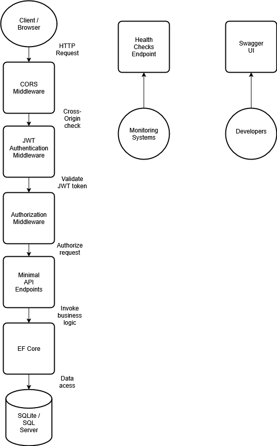

# .NET 9 Minimal API Starter

A production-ready .NET 9 Minimal API with JWT authentication, CORS, EF Core, Swagger, and health checks. Automatically detects SQLite (development) or SQL Server (production) from connection strings.

## Features

- **Authentication**: JWT Bearer tokens with Swagger integration
- **Database**: EF Core with automatic SQLite/SQL Server detection
- **API Documentation**: Swagger UI with Bearer auth support
- **Cross-Origin**: CORS policy configured for local development
- **Health Monitoring**: Built-in health checks endpoint
- **Containerization**: Docker and Docker Compose ready
- **Production Ready**: Structured logging, error handling, configuration management

## Architecture



## Quick Start

### Prerequisites
- .NET 9 SDK
- Docker Desktop (optional, for containerized deployment)
- Git

### Local Development (SQLite)

**PowerShell/Bash:**
```bash
git clone https://github.com/swc200git/dotnet-minimal-api-starter-demo.git
cd dotnet-minimal-api-starter-demo
cd Api
dotnet run
```

Open the Swagger URL displayed in the console (typically http://localhost:5000/swagger).

## Deployment Options

### Option 1: Docker with SQLite (Simple)

**PowerShell/Bash:**
```bash
cd dotnet-minimal-api-starter-demo
docker-compose up --build
```

API available at: http://localhost:8080/swagger

### Option 2: Docker with SQL Server (Production-like)

**PowerShell/Bash:**
```bash
cd dotnet-minimal-api-starter-demo
docker-compose -f docker-compose.sqlserver.yml up --build
```

API available at: http://localhost:8080/swagger

## Using the API

### 1. Get a JWT Token

**Swagger UI (Recommended):**
1. Open http://localhost:8080/swagger (or local port)
2. Expand `POST /auth/token`
3. Click "Try it out"
4. Use credentials: `{"username":"demo","password":"demo"}`
5. Copy the returned token

**PowerShell:**
```powershell
$response = Invoke-RestMethod -Uri "http://localhost:8080/auth/token" -Method Post -ContentType "application/json" -Body '{"username":"demo","password":"demo"}'
$token = $response.token
Write-Host "Token: $token"
```

**Bash (curl):**
```bash
TOKEN=$(curl -s -X POST "http://localhost:8080/auth/token" \
  -H "Content-Type: application/json" \
  -d '{"username":"demo","password":"demo"}' | jq -r '.token')
echo "Token: $TOKEN"
```

### 2. Test Authenticated Endpoint

**Swagger UI:**
1. Click the "Authorize" button (lock icon)
2. Enter: `Bearer YOUR_TOKEN_HERE`
3. Test `GET /secure/todos`

**PowerShell:**
```powershell
$headers = @{ Authorization = "Bearer $token" }
Invoke-RestMethod -Uri "http://localhost:8080/secure/todos" -Headers $headers
```

**Bash:**
```bash
curl -H "Authorization: Bearer $TOKEN" "http://localhost:8080/secure/todos"
```

## API Endpoints

| Method | Endpoint | Description | Auth Required |
|--------|----------|-------------|---------------|
| GET | `/health` | Health check | No |
| GET | `/todos` | List all todos | No |
| POST | `/todos` | Create a todo | No |
| GET | `/secure/todos` | List todos (secured) | Yes |
| POST | `/auth/token` | Get JWT token | No |

### Sample Requests

**Create a todo:**

**PowerShell:**
```powershell
$body = '{"title":"Learn .NET 9","done":false}'
Invoke-RestMethod -Uri "http://localhost:8080/todos" -Method Post -ContentType "application/json" -Body $body
```

**Bash:**
```bash
curl -X POST "http://localhost:8080/todos" \
  -H "Content-Type: application/json" \
  -d '{"title":"Learn .NET 9","done":false}'
```

## Configuration Options

### Database Connection

The application automatically detects database type from connection strings:

- **SQLite**: `Data Source=data/app.db`
- **SQL Server**: `Server=localhost,1433;Database=ApiDb;User Id=sa;Password=...;TrustServerCertificate=True`

### Environment Variables Override

**PowerShell:**
```powershell
# SQLite (custom location)
$env:ConnectionStrings__Default = "Data Source=C:\myapp\custom.db"
dotnet run

# SQL Server
$env:ConnectionStrings__Default = "Server=localhost,1433;Database=MyDb;User Id=sa;Password=MyPassword;TrustServerCertificate=True"
dotnet run
```

**Bash:**
```bash
# SQLite (custom location)
export ConnectionStrings__Default="Data Source=/var/myapp/custom.db"
dotnet run

# SQL Server
export ConnectionStrings__Default="Server=localhost,1433;Database=MyDb;User Id=sa;Password=MyPassword;TrustServerCertificate=True"
dotnet run
```

**Docker Environment Variables:**
```yaml
environment:
  - ConnectionStrings__Default=Server=sql,1433;Database=ApiDb;User Id=sa;Password=YourStrong_Password123;TrustServerCertificate=True
  - Jwt__Key=your_custom_jwt_secret_key_here
```

## Health Checks

**Browser:**
- Local: http://localhost:5000/health
- Docker: http://localhost:8080/health

**PowerShell:**
```powershell
Invoke-RestMethod -Uri "http://localhost:8080/health"
```

**Bash:**
```bash
curl "http://localhost:8080/health"
```

Returns `200 OK` with `Healthy` status when the application is running properly.

## Development

### Project Structure
```
├── Api/
│   ├── Data/
│   │   └── AppDb.cs                             # EF Core DbContext
│   ├── Models/
│   │   ├── Todo.cs                              # Todo entity
│   │   └── UserLogin.cs                         # Login request model
│   ├── Infrastructure/
│   │   └── BearerSecuritySchemeTransformer.cs   # OpenAPI configuration
│   ├── Program.cs                               # Application startup
│   ├── Dockerfile                               # Container configuration
│   └── Api.csproj                               # Project file
├── docker-compose.yml                           # SQLite deployment
├── docker-compose.sqlserver.yml                 # SQL Server deployment
├── docs/
│   └── architecture.png                         # System architecture diagram
└── README.md
```

### Adding New Endpoints

```csharp
// Add to Program.cs after existing endpoints
app.MapGet("/api/users", async (AppDb db) =>
    await db.Users.AsNoTracking().ToListAsync())
    .RequireAuthorization();  // Requires JWT token
```

### Running Tests

**PowerShell/Bash:**
```bash
dotnet test
```

## Docker Commands Reference

### Build and Run

**PowerShell/Bash:**
```bash
# SQLite version
docker-compose up --build

# SQL Server version
docker-compose -f docker-compose.sqlserver.yml up --build

# Run in background
docker-compose up -d --build

# Stop services
docker-compose down

# View logs
docker-compose logs -f api
```

### Troubleshooting

**Check container status:**

**PowerShell/Bash:**
```bash
docker ps
docker-compose ps
```

**View application logs:**

**PowerShell/Bash:**
```bash
docker-compose logs api
```

**Reset database (SQLite):**

**PowerShell:**
```powershell
Remove-Item -Path ".\data\app.db" -ErrorAction SilentlyContinue
dotnet run
```

**Bash:**
```bash
rm -f ./data/app.db
dotnet run
```

## Tech Stack

- **.NET 9** - .NET runtime
- **ASP.NET Core** - Web framework
- **EF Core** - Object-relational mapping
- **SQLite/SQL Server** - Database options
- **JWT Bearer** - Authentication
- **Swagger/OpenAPI** - API documentation
- **Docker** - Containerization

## Security Features

- **JWT Bearer Authentication** with secure token validation
- **CORS Policy** configured for development (customize for production)
- **Environment-based Configuration** to protect secrets
- **SQL Injection Protection** via EF Core parameterized queries
- **Health Checks** for monitoring and alerting

## Production Considerations

1. **Change JWT Secret**: Use a strong, random key in production
2. **Update CORS Policy**: Restrict to your actual frontend origins
3. **Use SQL Server**: For production workloads
4. **Enable HTTPS**: Configure SSL certificates
5. **Add Logging**: Implement structured logging with Serilog
6. **Monitor Health**: Set up automated health check monitoring

## Demo Video

🎥 [Watch a 5-minute walkthrough](YOUR_YOUTUBE_LINK_HERE) showing:
- Local development setup
- JWT authentication flow
- Docker deployment
- API testing in Swagger

## License

MIT License - see [LICENSE](LICENSE) for details.

